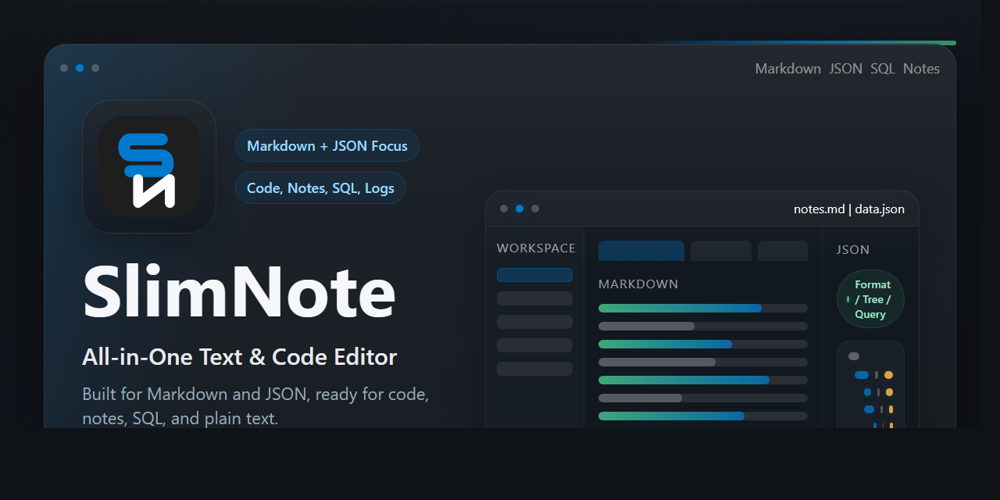

<div align="center">


# SlimNote

**All-in-One Text & Code Editor with Markdown + JSON Focus**

A modern desktop editor for Markdown, JSON, code, notes, SQL, logs, and everyday text work.

[](https://github.com/chengrady/SlimNote/releases/latest)
[](LICENSE)
[](https://github.com/chengrady/SlimNote)
[](https://github.com/chengrady/SlimNote/releases)

<p>
  <a href="https://github.com/chengrady/SlimNote/releases/latest">Download Latest Release</a>
  ·
  <a href="CHANGELOG.md">Changelog</a>
  ·
  <a href="#english">English</a>
  ·
  <a href="#zh-cn">简体中文</a>
</p>

</div>

<p align="center">
  
</p>

<a id="english"></a>

## English

### Overview

SlimNote is a desktop editor built for practical file work: Markdown writing, JSON cleanup, quick code edits, note taking, SQL formatting, and log inspection. It combines a Monaco-based code editor, a Milkdown-powered Markdown workflow, and built-in helper panels so common tasks stay in one focused window.

### Highlights

- Markdown workspace with WYSIWYG editing, source/preview flow, outline support, KaTeX, and Mermaid-aware PDF export
- Plain-text copy and rich copy from Markdown preview for Word and WeChat workflows
- JSON toolkit for formatting, compression, diff, tree view, schema generation, repair, and JMESPath query
- SQL formatting helpers plus multi-tab editing for code, notes, logs, and configuration files
- Pinned tabs, session restore, recent files, recent folders, file tree navigation, and external file change detection
- Presentation Mode, activity bar navigation, always-on-top pin window, status bar details, update check, and About dialog

### Built-In Tools

| Tool | What it helps with |
|------|---------------------|
| Markdown | WYSIWYG editing, preview, outline, export to PDF/image, plain-text copy, rich copy |
| JSON | Format, compress, diff, tree view, schema generation, repair, JMESPath query, format conversion |
| SQL | Formatting with dialect-aware helpers |
| Workspace | Pinned tabs, recent files/folders, file tree browsing, session restore |

### Download

- Latest release: [GitHub Releases](https://github.com/chengrady/SlimNote/releases/latest)
- Current published release assets: Windows installer (`.exe`) and Windows portable (`.exe`)
- Build scripts are available in the repository for Windows, macOS, and Linux

### Run from Source

```bash
git clone https://github.com/chengrady/SlimNote.git
cd SlimNote
npm install
npm run dev
```

### Build

```bash
npm run build
npm run build:win
npm run build:mac
npm run build:linux
```

Build artifacts are generated in the `release/` directory.

### Project Notes

- Release notes live in [CHANGELOG.md](CHANGELOG.md)
- The current README focuses on product overview and onboarding rather than version-by-version release details

<a id="zh-cn"></a>

## 简体中文

### 项目简介

SlimNote 是一个面向日常文件工作的桌面编辑器，适合处理 Markdown 编写、JSON 整理、代码修改、笔记记录、SQL 格式化和日志查看等场景。它把基于 Monaco 的代码编辑能力、基于 Milkdown 的 Markdown 工作流，以及常用辅助工具面板放进同一个专注的桌面窗口里。

### 核心亮点

- 提供 Markdown 所见即所得编辑、源码与预览协同、目录支持、KaTeX，以及兼顾 Mermaid 的 PDF 导出
- 支持从 Markdown 预览区复制纯文本和富文本，便于粘贴到 Word、微信等场景
- 内置 JSON 工具箱，支持格式化、压缩、Diff、树视图、Schema 生成、修复和 JMESPath 查询
- 提供 SQL 格式化能力，并支持代码、笔记、日志、配置文件等多标签编辑
- 支持固定标签、会话恢复、最近文件、最近文件夹、文件树导航和外部文件变更检测
- 提供演示模式、活动栏切换、置顶悬浮窗、状态栏信息、检查更新和 About 对话框

### 内置工具

| 工具 | 适用场景 |
|------|----------|
| Markdown | 所见即所得编辑、预览、目录、导出 PDF/图片、复制纯文本、复制富文本 |
| JSON | 格式化、压缩、Diff、树视图、Schema 生成、修复、JMESPath 查询、格式转换 |
| SQL | 多方言格式化辅助 |
| 工作区 | 固定标签、最近文件/文件夹、文件树浏览、会话恢复 |

### 下载方式

- 最新版本： [GitHub Releases](https://github.com/chengrady/SlimNote/releases/latest)
- 当前已发布的安装产物：Windows 安装版（`.exe`）和 Windows 便携版（`.exe`）
- 仓库中保留了 Windows、macOS、Linux 的构建脚本，可自行从源码构建

### 从源码运行

```bash
git clone https://github.com/chengrady/SlimNote.git
cd SlimNote
npm install
npm run dev
```

### 构建

```bash
npm run build
npm run build:win
npm run build:mac
npm run build:linux
```

构建产物会输出到 `release/` 目录。

### 项目说明

- 发版记录统一维护在 [CHANGELOG.md](CHANGELOG.md)
- 当前 README 主要负责介绍产品定位、能力范围和上手方式，不再按版本堆叠更新细节

## Supported File Types / 支持的文件类型

| Category / 类别 | Extensions / 扩展名 |
|-----------------|---------------------|
| Text / 文本 | `txt`, `text`, `md`, `markdown`, `mdx`, `log` |
| Data / 数据 | `json`, `jsonc`, `yaml`, `yml`, `xml`, `toml`, `csv`, `tsv` |
| Config / 配置 | `ini`, `conf`, `config`, `properties` |
| Web / Web 前端 | `html`, `htm`, `css`, `scss`, `sass`, `less`, `js`, `mjs`, `cjs`, `ts`, `mts`, `cts`, `jsx`, `tsx`, `vue` |
| Programming / 编程语言 | `py`, `java`, `c`, `cpp`, `cc`, `cxx`, `h`, `hpp`, `cs`, `sql` |
| Shell & Script / 脚本 | `sh`, `bash`, `zsh`, `ps1`, `bat`, `cmd` |
| Special Files / 特殊文件 | `.env`, `.env.*`, `.gitignore`, `.gitattributes`, `.editorconfig`, `Dockerfile`, `Makefile`, `README`, `LICENSE`, `CHANGELOG` |

## Keyboard Shortcuts / 快捷键

| Action / 功能 | Windows/Linux | macOS |
|---------------|---------------|-------|
| New File / 新建文件 | `Ctrl+N` | `Cmd+N` |
| Open File / 打开文件 | `Ctrl+O` | `Cmd+O` |
| Open Folder / 打开文件夹 | `Ctrl+Shift+O` | `Cmd+Shift+O` |
| Save / 保存 | `Ctrl+S` | `Cmd+S` |
| Save As / 另存为 | `Ctrl+Shift+S` | `Cmd+Shift+S` |
| Find / 查找 | `Ctrl+F` | `Cmd+F` |
| Replace / 替换 | `Ctrl+H` | `Cmd+H` |
| Global Search / 全局搜索 | `Ctrl+Shift+F` | `Cmd+Shift+F` |
| Toggle Fullscreen / 切换全屏 | `F11` | `Ctrl+Cmd+F` |
| Presentation Mode / 演示模式 | `Shift+F5` | `Shift+Cmd+P` |

## Tech Stack / 技术栈

| Technology | Version | Description |
|------------|---------|-------------|
| [Electron](https://www.electronjs.org/) | 28.3.3 | Desktop application shell |
| [Vue](https://vuejs.org/) | 3.4.21 | UI framework |
| [Vite](https://vitejs.dev/) | 5.1.6 | Build tool and dev server |
| [Pinia](https://pinia.vuejs.org/) | 2.1.7 | State management |
| [Monaco Editor](https://microsoft.github.io/monaco-editor/) | 0.47.0 | Code editing engine |
| [Milkdown](https://milkdown.dev/) | 7.18.0 | Markdown editing experience |
| [Vue I18n](https://vue-i18n.intlify.dev/) | 9.14.5 | Internationalization |
| [electron-builder](https://www.electron.build/) | 24.13.3 | Packaging and distribution |

## Roadmap / 路线图

- [ ] Snippet library / 代码片段管理
- [ ] Custom shortcuts / 自定义快捷键
- [ ] Plugin system / 插件系统
- [ ] Git integration / Git 集成
- [ ] Terminal integration / 终端集成
- [ ] Remote file editing (`SSH` / `FTP`) / 远程文件编辑
- [ ] Collaborative editing / 协作编辑

## Contributing / 参与贡献

1. Fork the repository / Fork 本仓库
2. Create a feature branch: `git checkout -b feature/YourFeature`
3. Commit your changes: `git commit -m "feat: describe your change"`
4. Push your branch: `git push origin feature/YourFeature`
5. Open a pull request / 提交 Pull Request

## License / 许可证

This project is licensed under the [MIT License](LICENSE).  
本项目基于 [MIT License](LICENSE) 开源。
